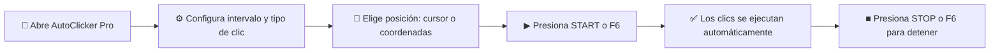

# ⚡ AutoClicker Pro v1.0

<div align="center">


### 🎯 Auto-clicker profesional con marca de agua para Linux Mint Cinnamon

**Desarrollado por Qwen** • Interfaz moderna • Sin dependencias manuales • Listo para usar

[Características](#-características) • [Instalación](#-instalación-rápida) • [Uso](#-uso-rápido) • [Solución de Problemas](#-solución-de-problemas)

---

<p align="center">
  
</p>

</div>

---

## 🌟 Características

<div align="center">

| **Básicas** | **Avanzadas** | **Profesionales** |
|:-----------:|:-------------:|:-----------------:|
| ✅ Intervalo personalizable | 🚀 Modo ráfaga (burst) | 🎙 Grabación de macros |
| ✅ Múltiples tipos de clic | ⏱ Temporizador de inicio | 💾 Perfiles guardables |
| ✅ Posición dinámica/fija | 📈 Estadísticas en vivo | 🔊 Feedback de sonido |
| ✅ Hotkeys globales (F6/F7) | ⚡ Modo turbo progresivo | 🎨 Animación de clic |
| ✅ Siempre visible | 🌫 Overlay transparente | 📊 Contador de CPS |

</div>

---

## 📦 Instalación Rápida

### Opción A: Script Automático (Recomendado)

```bash
# 1️⃣ Clona o descarga el proyecto
cd /workspace/AutoClickerPro

# 2️⃣ Ejecuta el script de construcción
chmod +x build.sh && ./build.sh

# 3️⃣ ¡Listo! Encuentra AutoClicker Pro en:
#    - Menú de aplicaciones → Accesorios
#    - O ejecuta: ~/AutoClickerPro/AutoClickerPro
```

### Opción B: Ejecución Directa (Desarrollo)

```bash
# Instalar dependencias
pip install pynput pygame pyinstaller

# Ejecutar sin compilar
python autoclicker_pro.py
```

---

## 🎮 Uso Rápido

<div align="center">

| Tecla | Acción |
|:-----:|--------|
| **F6** | ▶ Iniciar / ■ Detener auto-click |
| **F7** | 📍 Capturar coordenadas actuales |
| **Alt+F4** | 🚪 Salir de la aplicación |

</div>

### Flujo Básico



### Modos Especiales

#### 🎯 Modo Multi-Punto
1. Activa "Multi-punto secuencial"
2. Haz clic en "Capturar posición" para cada punto (máx. 5)
3. El auto-clicker alternará entre los puntos capturados

#### 🎙 Grabar Macro
1. Presiona **● REC** para comenzar a grabar
2. Realiza tus clics normalmente
3. Presiona **● REC** nuevamente para detener
4. Usa **▶ PLAY** para reproducir o **💾 Guardar** para persistir

#### ⚡ Modo Turbo
- Activa el checkbox "Turbo"
- La velocidad aumenta un 5% cada 100 clics
- Ideal para tareas que requieren aceleración progresiva

---

## 🎨 Personalización

### Temas y Apariencia
- **Tema oscuro** inspirado en Catppuccin
- **Opacidad ajustable** (30% - 100%)
- **Always on top** para mantener visible
- **Marca de agua** "AutoClicker Pro v1.0 — by Qwen"

### Perfiles
Guarda hasta **5 configuraciones personalizadas**:
```bash
# Los perfiles se guardan en:
~/.autoclicker_profiles.json
```

---

## ⚠️ Solución de Problemas

<details>
<summary><b>❌ "Permiso denegado" al iniciar</b></summary>

```bash
# Ejecuta este comando y reintenta:
xhost +local:
```
</details>

<details>
<summary><b>❌ La aplicación no aparece en el menú</b></summary>

```bash
# Actualiza el caché de aplicaciones
update-desktop-database ~/.local/share/applications
```
</details>

<details>
<summary><b>❌ Los clics no se registran en ciertas aplicaciones</b></summary>

Algunas aplicaciones (especialmente juegos anti-cheat o terminal) bloquean eventos sintéticos. Prueba:
- Ejecutar la aplicación objetivo en modo ventana
- Usar modo "posición actual del cursor" en lugar de coordenadas fijas
</details>

<details>
<summary><b>❌ El overlay no se muestra correctamente</b></summary>

Asegúrate de estar usando **X11** (predeterminado en Cinnamon):
```bash
echo $XDG_SESSION_TYPE
# Debe mostrar: x11
```
</details>

---

## 📊 Especificaciones Técnicas

| Componente | Tecnología |
|------------|------------|
| **Lenguaje** | Python 3.10+ |
| **GUI** | tkinter + ttk |
| **Inyección de eventos** | pynput |
| **Sonido** | pygame.mixer |
| **Empaquetado** | PyInstaller --onefile --windowed |
| **Configuración** | JSON (~/.autoclicker_config.json) |
| **Tamaño binario** | < 20 MB |

---

## 📝 Licencia y Créditos

<div align="center">

**Desarrollado por Qwen Coder**  
*Ingeniería de software senior especializada en Linux Desktop*

📄 **Licencia MIT** - Uso libre y modificación permitida

```
╔═══════════════════════════════════════════════════╗
║  AutoClicker Pro v1.0 — by Qwen                   ║
║  © 2024 - Todos los derechos reservados           ║
╚═══════════════════════════════════════════════════╝
```

⭐ **¡Gracias por usar AutoClicker Pro!**

</div>
